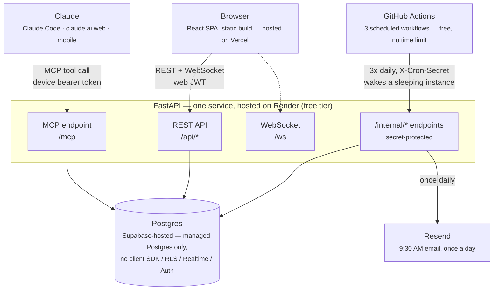
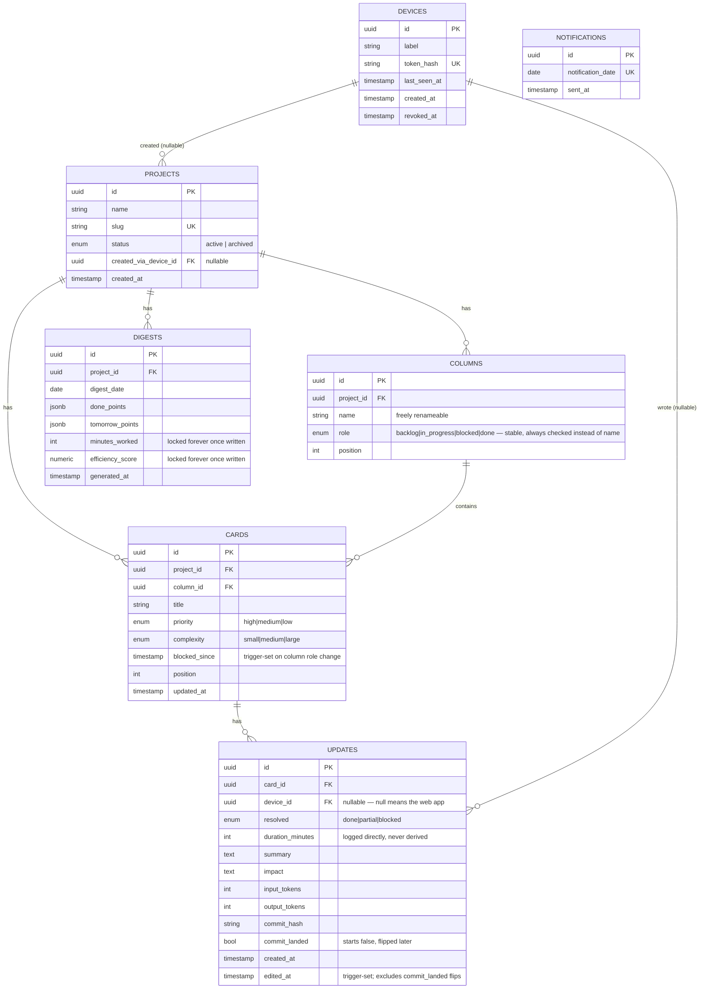
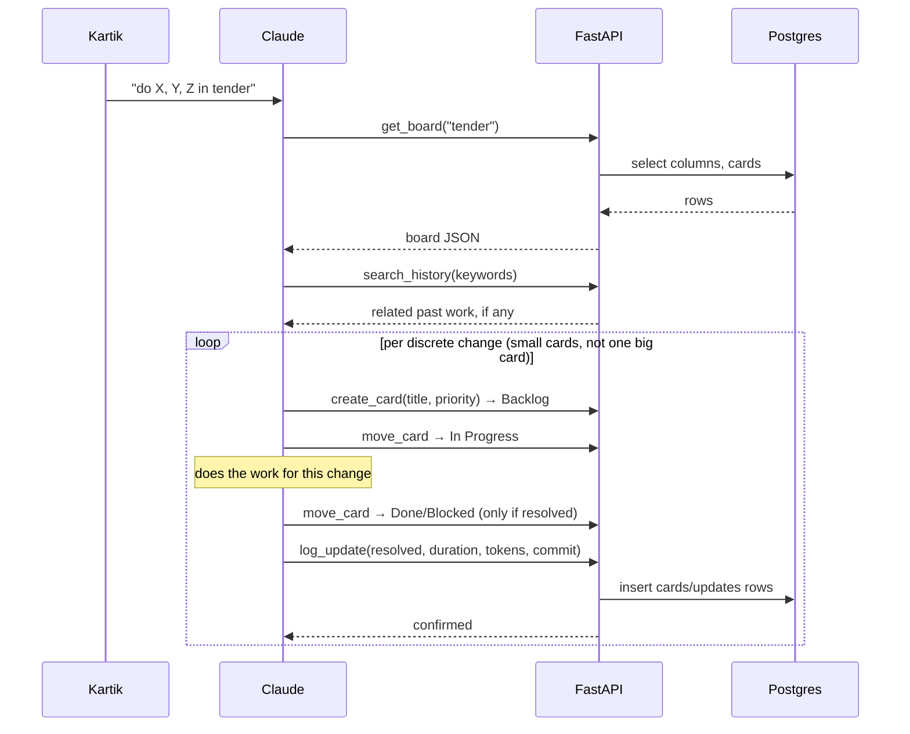
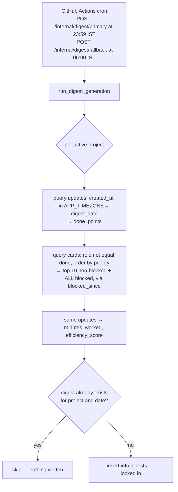
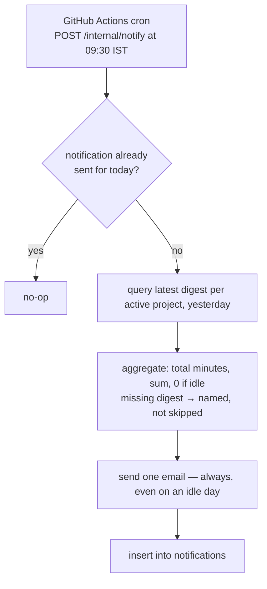

# Task Manager

A personal Kanban board with an MCP server wired into it. Mention a project
in conversation and Claude reads its board, does the work, creates and moves
cards, and logs what changed — automatically, across however many projects
you're juggling, from whichever device you're on. Every night at 11:59 PM
each project's day gets closed into a permanent digest; every morning at
9:30 you get one email covering all of them.

This README documents what actually exists in this repo. For the reasoning
behind each decision — the multi-round design process, the trade-offs
considered and rejected — see `CLAUDE.md` and the inline comments across
`backend/app/`; they're written to explain *why*, not just *what*.

---

## Quick start

```bash
# backend
cd backend
uv venv && uv pip install -e ".[dev]"
cp .env.example .env                              # fill in DATABASE_URL at minimum
uv run alembic upgrade head
uv run scripts/set_password.py "your password"    # paste the bcrypt hash into .env
uv run scripts/create_device.py "macbook"          # paste the printed token into your MCP config
uv run uvicorn app.main:app --reload

# frontend
cd frontend
npm install
cp .env.example .env
npm run dev
```

Point Claude Code's MCP config (or a claude.ai Connector, for web/mobile) at
`http://localhost:8000/mcp` with the device token from `create_device.py`.

---

## Deployment

**Backend → Render, free tier**, not Vercel — Vercel's FastAPI support runs
as a serverless function that scales with traffic, and Render's paid plans
cost real money every month. Neither is required: this backend has no
in-process scheduler and no in-memory state that needs a guaranteed-alive
process (see "Architecture" below) — scheduling is external, via GitHub
Actions. The one honest cost of the free tier: the instance sleeps after
~15 min idle and takes 30-60s to wake on the next request, which means an
open WebSocket connection drops and briefly reconnects if nobody's touched
the app in a while. No data loss, just a momentary lag.

1. **Render**: New + → **Blueprint** (not "Web Service" — Blueprint reads `backend/render.yaml` and configures everything itself: build command, start command, health check, single-process constraint, free plan).
2. Fill in the real values for every env var marked `sync: false` in `render.yaml` (same names as `backend/.env.example`) when Render prompts for them.
3. `alembic upgrade head` runs automatically as part of the start command every time the service boots (idempotent — a no-op once already at head; `preDeployCommand` needs a paid Render plan, not available free). You'll get a URL like `https://task-manager-backend.onrender.com`.
4. **GitHub**: in this repo's Settings → Secrets and variables → Actions, add `RENDER_BACKEND_URL` (the URL from step 3) and `INTERNAL_CRON_SECRET` (matching what you set in step 2). The three workflows in `.github/workflows/` pick these up automatically — no further setup.
5. Update `backend/app/main.py`'s CORS `allow_origins` from `"*"` to the real Vercel URL once the frontend is deployed below.

**Frontend → Vercel** — static build, root directory `frontend`, framework `Vite`. Set `VITE_API_URL` to the Render service's URL from step 3.

---

## Architecture

One FastAPI service is the only thing that ever touches Postgres. The
browser and Claude both go through it — never around it, never to the
database directly. That's the entire consequence of choosing a proper
backend gateway over talking to Supabase's client SDK straight from the
frontend: you lose Supabase's free realtime and auth, and get them back by
hand (a WebSocket broadcaster, two separate auth mechanisms) in exchange for
one real API surface instead of your database schema being your API.



**Two separate auth mechanisms reach the same service by two different
doors** — a per-device bearer token for MCP (`devices.token_hash`), a web
JWT for the browser (single-user login, private hosting only). Neither is
aware of the other.

---

## MCP tool surface

| Tool | Shape | Notes |
|---|---|---|
| `get_board(project)` | check | current columns + cards for one project |
| `search_history(keywords, project?)` | check | cross-project by default |
| `get_digest(project?, range)` | check | omit project for the combined cross-project view |
| `create_project(name)` | update | idempotent by slug, includes default columns |
| `create_card(title, priority)` | update | into Backlog |
| `move_card(card_id, target_role)` | update | targets a column **role**, never a display name |
| `log_update(card_id, resolved, duration_minutes, summary, ...)` | update | `device_id` is never a parameter |
| `mark_commit_landed(update_id)` | update | doesn't count as an "edit" — see below |

`device_id` is resolved server-side from the bearer token on every write —
Claude never passes it, so there's no string to get wrong. Dragging a card
or editing it on the site takes the same code paths with `device_id` left
`null`.

---

## Data model



`digests` rows are a **locked snapshot**, not a cache — reopening a "done"
card next week or editing a card's complexity next month must not silently
rewrite last month's efficiency score. That's the entire reason the table
exists instead of everything being computed live.

---

## How a prompt turns into board changes



The web app takes the identical write path — same FastAPI endpoints, same
tables — with `device_id` left `null`, then broadcasts the change over its
open WebSocket so the board updates instantly for anyone else watching it.

---

## Daily digest — 23:59 primary, 06:00 fallback



The date match runs in `APP_TIMEZONE` (Asia/Kolkata), not the database's
default UTC — a raw date cast would misattribute anything logged between
midnight and ~5:30 AM IST to the wrong day. The three cron times have a
hard order: 23:59 → 06:00 → 09:30 (below) each depend on the previous one
having had a chance to run.

## Morning notification — 09:30, one email for everything



A missing email is ambiguous — did nothing happen, or did the job break?
Sending a "0 minutes" email isn't.

---

## Productivity

```
efficiency = Σ(complexity_weight × resolution_credit) ÷ Σ(duration_minutes) ÷ 60
```

| complexity | weight | | resolved | credit |
|---|---|---|---|---|
| small | 1 | | done | 1.0 |
| medium | 3 | | partial | 0.5 |
| large | 5 | | blocked | 0 |

First-pass weights, not locked — easy to re-tune once real numbers exist to
compare against how a day actually felt. "Today" is computed live and is
provisional until the 23:59 cron locks it into `digests`; Week/Month read
that locked history and chart one point per day. Per-device and per-card
breakdowns are both reconstructed live from `updates` — only the two
headline numbers are ever frozen.

---

## Project layout

```
backend/app/
  main.py          FastAPI app — mounts REST routers + MCP server on /mcp
  models.py        SQLAlchemy models (must match the Alembic migration exactly)
  auth.py          device tokens (MCP) + web JWT (site) — two separate mechanisms
  mcp_server.py    the 8 MCP tools — thin wrappers over services/
  websocket.py     in-memory broadcast manager (see its docstring for the scaling ceiling)
  services/        shared logic: board, history, updates, digest, productivity
  routers/         REST endpoints, mirroring the service layer
  jobs/            the three scheduled crons
backend/alembic/versions/0001_initial_schema.py   schema + triggers, source of truth
frontend/src/
  api/client.ts    the only place that talks to the backend
  pages/           Board, Today, Productivity, Overview, Devices, Login
```

## Non-obvious things, if you're about to change this code

- **`device_id` is never a tool argument** — resolved from the auth token. Adding a `device` parameter to an MCP tool is the bug this design specifically avoids.
- **Columns are matched by `role`, never `name`** — `name` is freely renameable by the user.
- **`cards.blocked_since` is trigger-set**, survives partial-progress updates without resetting — don't compute "days blocked" from the latest update row.
- **`updates.edited_at`** excludes `commit_landed` flips on purpose — that field means "corrected after the fact," not "routine lifecycle event."
- **`digests` rows never get overwritten.** Ever.
- **No dedup logic, anywhere, on purpose** — two devices creating overlapping cards is fine.

---

## Status

Backend and frontend are scaffolded and both build/import cleanly. The
migration has been run against a real local Postgres and both triggers
(`blocked_since`, `edited_at`) verified to behave exactly as designed —
including that a partial-progress edit doesn't reset days-blocked, and that
`mark_commit_landed` doesn't falsely count as an edit. No test suite yet —
per the project's own `CLAUDE.md`, tests arrive with the next real feature,
not retroactively bolted onto code that's still settling. No live MCP
session or REST/WebSocket smoke test against a running `uvicorn` process
yet either — schema-level correctness is confirmed, request-level isn't.
